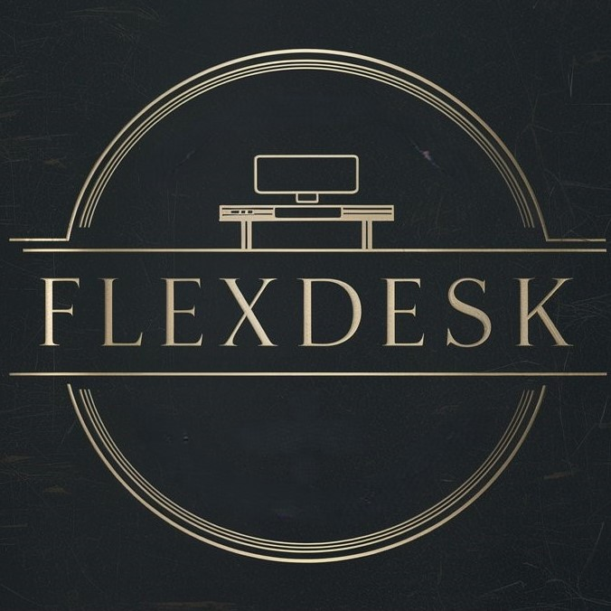
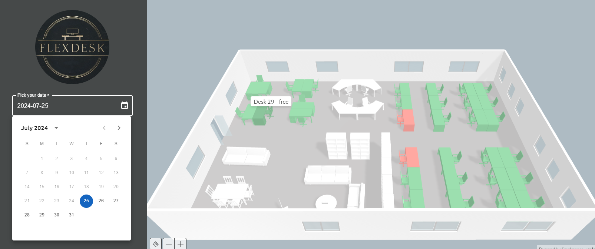
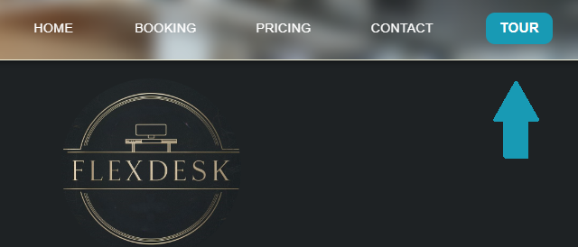

# FlexDesk



## Table of Contents
- [Introduction](#introduction)
- [Live Version](#live-version)
- [Installation](#installation)
- [Technologies](#technologies)
- [Frameworks and Libraries](#frameworks-and-libraries)
- [Usage](#usage)
- [Features](#features)

## Introduction

FlexDesk is a web application designed for easy desks booking on a 3D model. It provides an intuitive interface to select available desks based on the chosen date. 



The application also includes a tour guide to help new users navigate through the features.



## Live Version

You can access the live version of the application [here](https://space-booking-seven.vercel.app/).

### Test Account Credentials

Use the following credentials to log in and test the application:

- **E-mail:** testuser@flexdesk.com
- **Password:** Test123@
## Installation

1. Clone the repository:
    ```sh
    git clone https://github.com/Naygel22/space-booking.git
    cd space-booking
    ```

2. Install dependencies:
    ```sh
    npm install
    ```

3. Start the development server:
    ```sh
    npm run dev
    ```

4. The application should now be running on `http://localhost:3000`.

## Technologies 

- HTML,
- CSS,
- Typescript,
- PostgreSQL (supabase)

## Frameworks and Libraries
- React - Library for building user interfaces,
- Formik - Forms with easy-to-use validation,
- Yup - Form validation,
- TanStack Query - asynchronous state management 
- Apache ECharts - interactive charting and visualization library for browser,
- MUI - Framework with pre-designed Material Design components,
- Toastify - Customizable notification library for React,
- React-joyride - Tour through the application

## Usage

1. **Login:** Users need to log in to access the booking features.
2. **Select Date:** Use the date picker to select a date for booking.
3. **View Availability:** Check the availability of desks for the selected date.
4. **Book Desk:** Reserve a desk by clicking on an available desk.
5. **Manage Bookings:** View or cancel your existing bookings.

## Features

- User authentication
- Date picker to select booking dates
- Real-time desk availability viewer
- Booking management (create, view, cancel bookings)
- Interactive tour guide for new users


